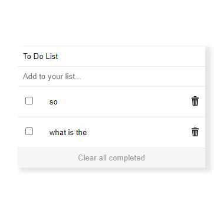

# Project Name

To Do List Application Cool

# PR

1-Add items to the to do list
2-Checkbox input form 

## Built With

- Html
- css
- JavaScript

## live demo :
- https://meqdamalqudah.github.io/To-Do-List/

## Getting Started

-open the index.html file in chrome and see the To do list

### Setup

-first make sure that you installed npm in your terminal add this code 
1- :npm init -y
2- npm run build
3- npm start 
then you can see the server of webpack and you can see your code.

#### To get a local copy up and running follow these simple example steps.

- Click the green `Code` button on the repo and copy link
- In your local PC, open your terminal in the folder you would like to clone the project.
- Clone the repo with the command: `git clone (copied link)`; like so: `git clone https://github.com/MeqdamAlqudah/To-Do-List`
- On the terminal, navigate into the directory like so: `cd To-Do-List`

### Prerequisites

Chrome or any explorer

## Authors

👤 **Meqdam Al-qudah**

- [GitHub](https://github.com/MeqdamAlqudah)
- [Twitter](https://twitter.com/MeqdamQudah)
- [LinkedIn](www.linkedin.com/in/meqdam-al-qudah-7514a21b5)
=======
##PR

